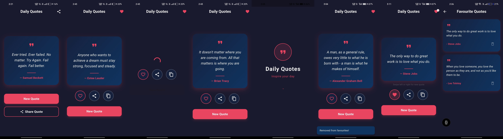

# Random Quote Generator - Flutter

Built this as part of the **CodeAlpha App Development Internship (Task 2)**. The goal was to create a random quote generator app with a clean minimal UI, **API integration (ZenQuotes),** and additional features like favourites and sharing.

---

## Screenshots

### All Screens
Quote screen with live API quotes, favourites with badge counter, splash screen, snackbar feedback and favourites screen.

---

## What this app does

A mobile app that fetches and displays random inspirational quotes across three core screens:

**Splash Screen** - animated launch screen with scale and fade animation. Shows the app logo, title and a loading indicator before transitioning smoothly into the main screen.

**Quote Screen** - fetches a random quote from the ZenQuotes API every time the app opens or the user requests a new one. Users can swipe left or right to get a new quote, tap the heart to save it, share it to other apps, or copy it to clipboard. A badge on the app bar heart icon shows the number of saved quotes.

**Favourites Screen** - displays all saved quotes in a scrollable list. Each quote card shows the text, author, and a delete button. Removing a quote shows a snackbar confirmation.

---

## Architecture

Kept it clean with a **Service-based architecture**:

- Model - Quote data structure with fromJson factory for API parsing
- Service - QuoteService handles API calls with fallback for no internet. FavouritesService handles local persistence using shared_preferences
- Screen - each screen is self contained and calls services directly
- State managed locally with StatefulWidget and setState

---

## Screens built

- **SplashScreen** - animated logo with scale and fade using AnimationController, auto navigates after 3 seconds with a fade page transition
- **QuoteScreen** - fetches from ZenQuotes API, fade animation on new quote, swipe gesture detection, favourite toggle with animated heart, share and copy functionality, badge counter on app bar
- **FavouritesScreen** - persistent list using shared_preferences, delete with snackbar feedback, empty state with icon and message

---

## Stack

- Flutter 3.41.7 (stable)
- Dart 3.11.5
- http 1.2.1 - ZenQuotes API integration
- share_plus 9.0.0 - native share sheet
- shared_preferences - local quote persistence
- Custom AnimationController for splash and fade animations

---

## Notes

- Portrait mode only, optimized for mobile
- API calls wrapped in try-catch block — if ZenQuotes API is unavailable or device has no internet, app gracefully falls back to a hardcoded quote instead of crashing
- Fallback quote: "The only way to do great work is to love what you do." by Steve Jobs
- mounted checks used before all async context operations to prevent setState calls on unmounted widgets
- withValues(alpha:) used throughout instead of deprecated withOpacity()
- Swipe velocity threshold set at 300 to avoid accidental triggers

---

## Internship

Built as part of the **CodeAlpha App Development Internship**
- Company: [CodeAlpha](https://www.codealpha.tech)
- Task 2: Random Quote Generator

---

## Developer

**Aditya**
- GitHub: [@comradeaditya](https://github.com/comradeaditya)